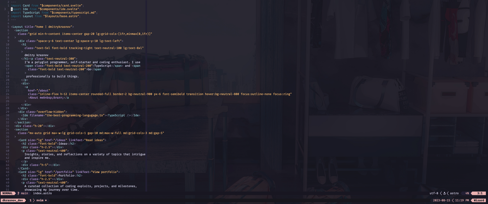

# Neovim setup

Requires [Neovim](https://neovim.io) (>=0.8)

- [wbthomason/packer.nvim](https://github.com/wbthomason/packer.nvim) - A plugin manager for Neovim
- [nvim-lualine/lualine.nvim](https://github.com/nvim-lualine/lualine.nvim) - A blazing fast and easy to configure Neovim statusline written in Lua
- [onsails/lspkind-nvim](https://github.com/onsails/lspkind-nvim) - VSCode-like pictograms
- [L3MON4D3/LuaSnip](https://github.com/L3MON4D3/LuaSnip) - Snippet Engine for Neovim written in Lua
- [hrsh7th/cmp-nvim-lsp](https://github.com/hrsh7th/cmp-nvim-lsp) - nvim-cmp source for neovim's built-in LSP
- [hrsh7th/cmp-buffer](https://github.com/hrsh7th/cmp-buffer) - nvim-cmp source for buffer words
- [hrsh7th/nvim-cmp](https://github.com/hrsh7th/nvim-cmp) - A completion engine plugin for neovim written in Lua
- [neovim/nvim-lspconfig](https://github.com/neovim/nvim-lspconfig) - A collection of configurations for Neovim's built-in LSP
- [jose-elias-alvarez/null-ls.nvim](https://github.com/jose-elias-alvarez/null-ls.nvim) - Use Neovim as a language server to inject LSP diagnostics, code actions, and more via Lua.
- [williamboman/mason.nvim](https://github.com/williamboman/mason.nvim) - Portable package manager for Neovim that runs everywhere Neovim runs. Easily install and manage LSP servers, DAP servers, linters, and formatters
- [williamboman/mason-lspconfig.nvim](https://github.com/williamboman/mason-lspconfig.nvim) - Extension to mason.nvim that makes it easier to use lspconfig with mason.nvim
- [nvim-treesitter/nvim-treesitter](https://github.com/nvim-treesitter/nvim-treesitter) - [Treesitter](https://github.com/tree-sitter/tree-sitter) configurations and abstraction layer for Neovim
- [kyazdani42/nvim-web-devicons](https://github.com/kyazdani42/nvim-web-devicons) - Lua `fork` of vim-web-devicons for neovim
- [nvim-telescope/telescope.nvim](https://github.com/nvim-telescope/telescope.nvim) - A highly extendable fuzzy finder over lists
- [windwp/nvim-autopairs](https://github.com/windwp/nvim-autopairs) - Autopairs
- [windwp/nvim-ts-autotag](https://github.com/windwp/nvim-ts-autotag) - Use treesitter to auto close and auto rename html tag
- [folke/zen-mode.nvim](https://github.com/folke/zen-mode.nvim) - Distraction-free mode
- [laytan/cloak.nvim](https://github.com/laytan/cloak.nvim) - Cloak allows you to overlay \*'s (or any other character) over defined patterns in defined files
- [theprimeagen/harpoon](https://github.com/ThePrimeagen/harpoon) - The ability to specify, or on the fly, mark and create persisting key strokes to go to the files you want.
